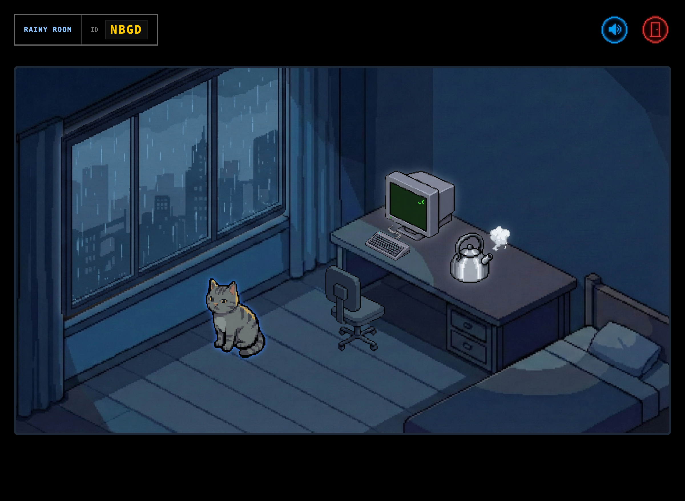

# Co-Fi ☕

> A multi-user collaborative visual Lo-Fi music social platform.

**Maximally Vibe-a-thon Submission**

[](https://devpost.com/software/cofi)
[](https://cofi.001015.xyz)
[](LICENSE)

## About the Project

### Inspiration

Throughout our academic journey, the **Lofi Girl** YouTube channel has been a constant companion. Back then, many of my classmates and I would virtually gather on the livestream, listening to relaxing beats and studying hard together. However, a YouTube livestream is never truly private. The rapidly scrolling chat and thousands of concurrent viewers often brought a sense of unease to us introverts.

We tried various alternatives, such as Chillhop, but found that commercialized apps often came with complex features that distracted from our simple desire. We didn't need complicated chat systems or chaotic playlists. We just wanted a slightly more private musical sanctuary—a place with light music, a cozy visual atmosphere, and a subtle cue that says, *"Someone else is here, too."*

Thus, **Co-Fi** was born. It is an online café composed of warm, inviting rooms. You can host a private room for yourself or join a friend's space. In this world, you are not an avatar, but an object within the room. By lighting up your chosen object, you signal to others—and to your own deepest self—amidst the elegant white noise: **"I am here."**

### Challenges & The "Hellish" 72 Hours

The development process was, frankly, a grueling odyssey.

1.  **Identity & Time Pressure:** As sophomore university students, we were caught in a tug-of-war between a tight 72-hour development deadline and our regular academic coursework. We had to squeeze every ounce of productivity out of our spare time.
2.  **Background:** Both of us are **Mathematics majors**. While we have a passion for coding and have built small programs before, we lacked experience with large-scale project architecture. This inexperience caused us to hit the wall repeatedly during development.
3.  **The Artistic Burden:** Creating the right atmosphere required a massive amount of art assets. The sheer volume of GIF animations and sprite sheets needed to bring the rooms to life nearly crushed our team.

### How we built it

The biggest technical hurdle was our choice of stack. We decided to use **React**, a framework we were less familiar with.

* **From Vue to React:** Our previous web development experience was primarily in Vue. Transitioning to the **React** and **Next.js** ecosystem—specifically figuring out how to leverage **React Server Components (RSC)** for full-stack functionality—was uncharted territory for us.
* **Learning by Doing:** We used this project as a forcing function to learn these new tools. A significant portion of our 72 hours was spent just familiarizing ourselves with the documentation and paradigms of Next.js.

### What we learned

In the end, after watching the sun set and rise again, and surviving two sleepless nights, we made it. Although the final result differs slightly from our grandest vision—we only completed one type of room so far—the core functionality and the atmospheric vibe met our expectations.

This project marks a temporary caesura in our development. We have successfully built a cozy corner of the internet, and we are excited to continue developing the remaining room designs in the future.

## 🖼️ Gallery

| Landing Page | Vibe Selection |
|:---:|:---:|
|  |  |
| Active Session | Join room |
|  |  |

## 🛠️ Built With

* **Frontend**: React, Next.js 15, TypeScript, Tailwind CSS
* **Backend**: Next.js API Routes
* **Database**: SQLite (`better-sqlite3`)
* **Deployment**: Docker, Render
* **Tools**: Gemini-CLI, Nano-Banana, SFX-Engine

## 🚀 Getting Started

### Installation

```bash
git clone git@github.com:ispcat/cofi.git
cd cofi
npm install
```

### Development

```bash
npm run dev
```

Open http://localhost:3000 in your browser.

### Build

```bash
npm run build
npm start
```

## 📄 License

This project is licensed under the Apache License 2.0.

---

*Built with ❤️ (and caffeine) by [wulukewu](https://github.com/wulukewu) & [rayhuang2006](https://github.com/rayhuang2006).*
